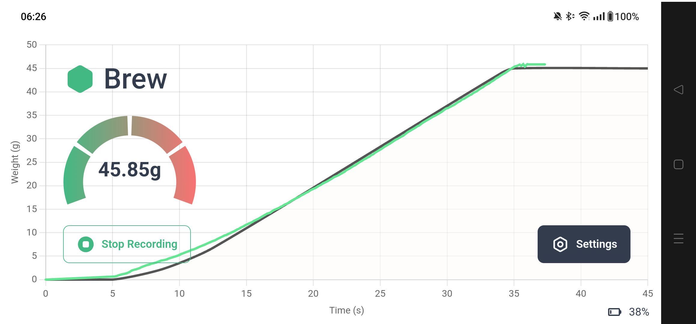

# DIY Smart Coffee and Espresso Scale

This project contains all the necessary software to program the
[ESP32 microcontroller](https://learn.sparkfun.com/tutorials/esp32-thing-hookup-guide) and interface with it through a
Bluetooth API-enabled web browser (Chrome, Opera).

The `rs` folder contains the source code for the Rust firmware that need to be flashed onto the ESP32. See the
[README](rs/README.md) for instructions.

The `src` folder contains the source for the Progressive Web App that allows to retrieve the scale's reading in real
time as well as the battery level.

The application is hosted at [coffee.beeb.li](https://coffee.beeb.li) for convenience of users desiring building the
scale.

## Settings

The app works as a timer to achieve the desired extraction in the desired time. A reference curve is displayed, taking
into account the user parameters:

- **Coffee Weight**: how much coffee grounds were put in the basket (the "Read" button puts the current scale value into
  this field)
- **Target Ratio**: the ratio of "coffee out" to "grounds in". The expected output weight is displayed next to the
  field.
- **Pre-infusion Time**: this is an amount of time that is added to the timer as soon as >0.5g are detected in the cup.
  This allows to indicate the desired total brew time including pre-infusion. It's the user responsibility to perform
  the pre-infusion with this amount of time.
- **Total Time**: the total brew time, including any pre-infusion.

## Workflow

- The basket or portafilter is put on the scale and tared with the scale's button.
- The desired amount of coffee grounds is put inside the basket
- the basket or portafilter is put back on the scales, thereby measuring the weight of the coffee grounds
- In the Settings pane, the "Read" button next to the "Coffee Weight" input is clicked to read the current value into it
- The cup is placed on the scale and it is tared with the button
- The "Start recording" button is pressed (only available when the scale reads 0g). The app now waits for an increase in
  weight.
- As soon as the weight exceeds 0.5g, the timer starts counting from the pre-infusion time (default 5s).
- The extraction can be followed in real time and should match the grey reference curve (in a direct drive lever machine
  , the user would adjust the pressure to match the curve)
- When the extraction is finished, the cup is lifted from the scale, thus stopping the recording.

## Features

- Dual-core microcontroller allows for fast sampling rate of the load cell and fast refresh rate of the 128x32 OLED
  display
- Load cell input is filtered with a Kalman filter for fast response and good smoothing
- The weight is communicated through Bluetooth Low Energy every 200ms
- The microcontroller can charge a LiPo or Li-ion battery and report its charge level
- The web-app persists user settings in the browser's local storage
- Can be added to the home screen of smartphones (_e.g._ with Chrome on Android, look almost like a native app)

## Design files

The 3D printable parts are available from the
[prusaprinters page of this project](https://www.prusaprinters.org/prints/36112-diy-bluetooth-coffeeespresso-scale).

## Forked version for ESP32 Feather breakout

User Nkawu forked part of this repo at the following location: https://github.com/Nkawu/coffee-scale-firmware

This alternative version uses a different microcontroller board and doesn't have any power button, as well as two
tactile function buttons.

## Acknowledgments

This project was made possible by the following projects and people (amongst others). Thanks to them!

- [esp-rs](https://github.com/esp-rs/)
- [signalo](https://github.com/signalo/signalo)
- [hx711](https://github.com/DaneSlattery/hx711) by DaneSlattery
- [esp32-nimble](https://github.com/taks/esp32-nimble/) by taks
- [ssd1306](https://github.com/jamwaffles/ssd1306) by jamwawaffles
- [chart.js](https://www.chartjs.org/)

## License

Distributed under the MIT License
